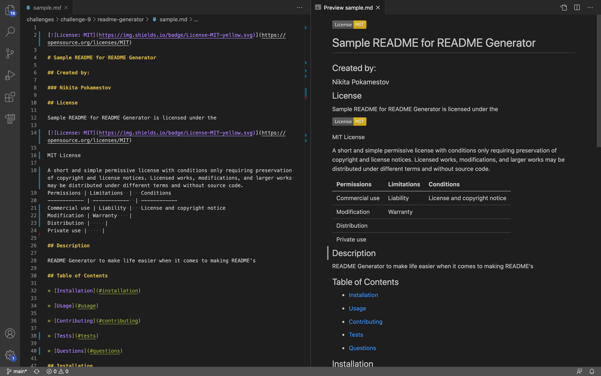

# Professional README Generator Starter Code

[How to create a Professional README](./readme-guide.md)

# README-Generator

## Summary

This application takes user inputs and creates a README using a template and then saves the file as [sample.md](./sample.md).

## Built With
* Javascript
* Node JS
* JSON

## Link

GitHub: https://github.com/npokamestov/readme-generator

## Video

https://drive.google.com/file/d/1vGc5axkaNFkz6WnjmMTcETOZNIm6KLUH/view

## Screenshot

